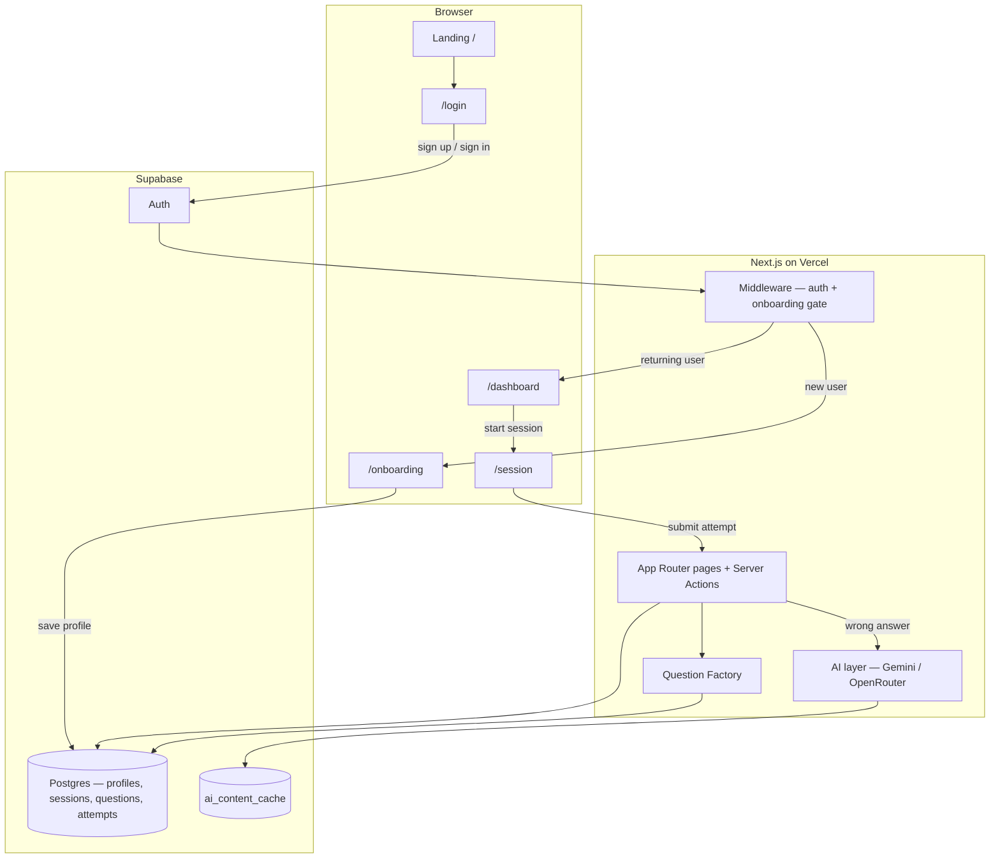
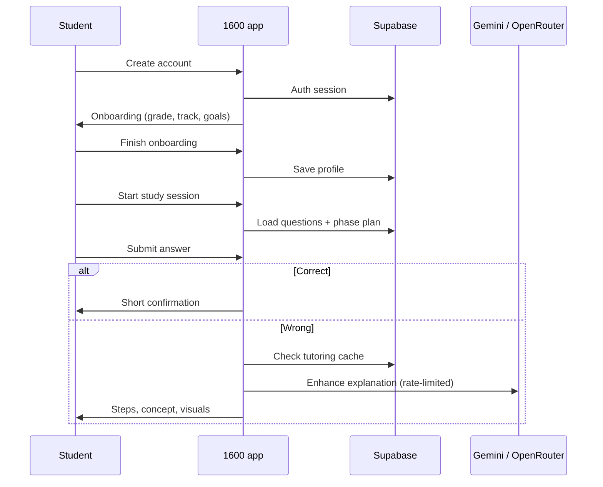
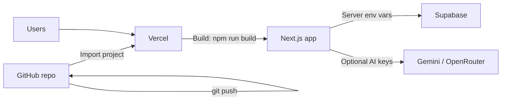

# 1600

Guided SAT/ACT prep — adaptive sessions, mistake review, and AI tutoring. Built with **Next.js 15** and **Supabase**.

## How it works



### Student journey (simplified)



## Local development

```bash
npm install
cp .env.local.example .env.local   # fill in keys
npm run dev                        # http://127.0.0.1:3000
```

If pages 404 or chunks break after many restarts:

```bash
npm run fix   # kills port 3000, clears .next, restarts dev
```

**Do not run `npm run build` while `npm run dev` is running** — mixed `.next` artifacts cause 500 errors.

## Supabase setup (once per project)

In the [Supabase SQL Editor](https://supabase.com/dashboard), run in order:

1. `supabase/schema.sql`
2. `supabase/seed.sql`
3. `supabase/complete_setup.sql` (if profile saves fail)
4. `supabase/migrations/20250525120000_tutoring_experience.sql`
5. `supabase/migrations/20250527120000_question_factory.sql`
6. `supabase/fix_reading_passages.sql` (if reading passages are missing)

**Auth:** Authentication → Providers → Email → turn **off** “Confirm email”.  
Add `SUPABASE_SERVICE_ROLE_KEY` in `.env.local` (Project Settings → API) for instant signup without email confirmation.

**Auth redirect URLs** (Authentication → URL configuration):

- Site URL: your production URL (e.g. `https://your-app.vercel.app`)
- Redirect URLs: `http://127.0.0.1:3000/**`, `https://your-app.vercel.app/**`

## Deploy on Vercel



1. Push this repo to [github.com/RehanMohammed985/1600](https://github.com/RehanMohammed985/1600).
2. In [Vercel](https://vercel.com) → **Add New Project** → import the repo.
3. Framework preset: **Next.js** (default). Build command: `npm run build`. Output: default.
4. Add **Environment Variables** (same as `.env.local.example`; never commit real keys):

   | Variable | Required |
   |----------|----------|
   | `NEXT_PUBLIC_SUPABASE_URL` | Yes |
   | `NEXT_PUBLIC_SUPABASE_ANON_KEY` | Yes |
   | `SUPABASE_SERVICE_ROLE_KEY` | Recommended (signup) |
   | `NEXT_PUBLIC_SITE_URL` | Yes in production (`https://…vercel.app`) |
   | `GEMINI_API_KEY` or `OPENROUTER_API_KEY` | Optional (tutoring AI) |
   | `AI_PROVIDER` | Optional (`gemini` or `openrouter`) |

5. Deploy. Update Supabase redirect URLs to your Vercel domain.

## Environment variables

See `.env.local.example`. Copy to `.env.local` for local dev. Set the same names in Vercel → Project → Settings → Environment Variables.

## Routes

| Path | Purpose |
|------|---------|
| `/` | Landing (redirects signed-in users) |
| `/login` | Sign in / sign up |
| `/onboarding` | First-time setup |
| `/dashboard` | Home + start session |
| `/session?id=` | Active study session |

## Push to GitHub (when ready)

```bash
git remote add origin https://github.com/RehanMohammed985/1600.git
git branch -M main
git push -u origin main
```

## Agent map

See `AGENTS.md` for which files to touch per feature.
