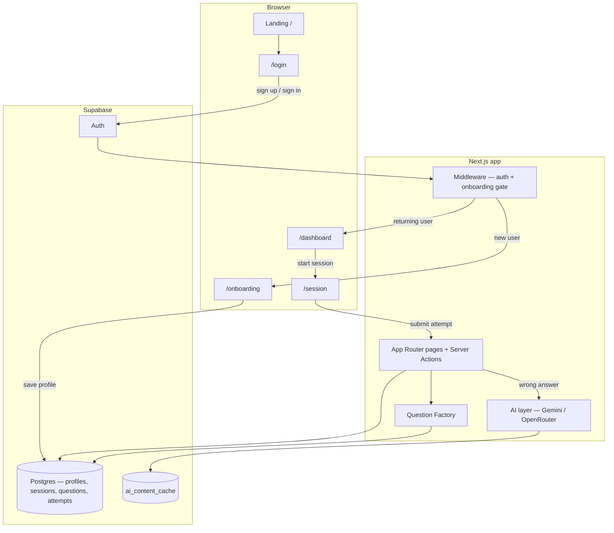
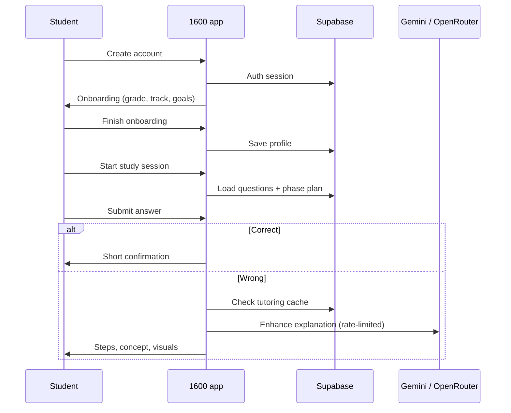

# 1600

**1600** is an open-source SAT/ACT study app that adapts to each student’s grade, goals, and weak skills. Practice in guided sessions, review mistakes with step-by-step explanations, and optional AI tutoring when you get a question wrong.

Built with [Next.js 15](https://nextjs.org/) and [Supabase](https://supabase.com/).

## Features

- **Adaptive sessions** — phased study blocks tuned to skill level and study mode
- **Onboarding** — grade, test track (SAT/ACT), goals, and timeline
- **Mistake review** — why your answer was wrong, common traps, concepts, and visuals
- **Optional AI tutoring** — Gemini or OpenRouter enhances explanations (cached and rate-limited)
- **Question bank** — seeded questions plus a factory pipeline for new items

## How it works



### Student journey



## Prerequisites

| Tool | Notes |
|------|--------|
| [Node.js](https://nodejs.org/) 18+ | For local development |
| [Supabase](https://supabase.com/) account | Free tier is enough to try the app |
| Git | To clone this repository |

**Optional:** API key from [Google AI Studio](https://aistudio.google.com/apikey) (Gemini) or [OpenRouter](https://openrouter.ai/) for AI-enhanced wrong-answer explanations.

## Getting started

These steps assume you are running the app on your own machine against **your own** Supabase project. You will create credentials locally — nothing secret is stored in this repository.

### 1. Clone and install

```bash
git clone https://github.com/<owner>/<repo>.git
cd <repo>
npm install
```

Replace `<owner>/<repo>` with this repository’s GitHub path after you fork or clone it.

### 2. Configure environment variables

```bash
cp .env.local.example .env.local
```

Open `.env.local` and add your values. **Do not commit `.env.local`** — it is listed in `.gitignore`.

| Variable | Required | Description |
|----------|----------|-------------|
| `NEXT_PUBLIC_SUPABASE_URL` | Yes | Project URL from Supabase → **Settings → API** |
| `NEXT_PUBLIC_SUPABASE_ANON_KEY` | Yes | `anon` / public key from the same page |
| `SUPABASE_SERVICE_ROLE_KEY` | Recommended | Service role key — allows signup without email confirmation when using server-side account creation |
| `NEXT_PUBLIC_SITE_URL` | Yes (local) | Use `http://127.0.0.1:3000` for local development |
| `GEMINI_API_KEY` | Optional | Enables AI tutoring via Google Gemini |
| `OPENROUTER_API_KEY` | Optional | Enables AI tutoring via OpenRouter |
| `AI_PROVIDER` | Optional | Set to `gemini` or `openrouter` when using AI |
| `GEMINI_MODEL` / `OPENROUTER_MODEL` | Optional | Model names (see `.env.local.example` for examples) |

See `.env.local.example` for the full list and placeholder values.

### 3. Initialize the database

Create a new Supabase project, then open the **SQL Editor** and run the files below **in order** (copy/paste each file’s contents):

| Order | File | Purpose |
|-------|------|---------|
| 1 | `supabase/schema.sql` | Core tables, RLS, auth trigger |
| 2 | `supabase/seed.sql` | Sample questions |
| 3 | `supabase/migrations/20250525000000_onboarding_student_path.sql` | Onboarding fields |
| 4 | `supabase/migrations/20250525120000_tutoring_experience.sql` | Tutoring / attempts metadata |
| 5 | `supabase/migrations/20250526120000_intelligence.sql` | Adaptive intelligence tables |
| 6 | `supabase/migrations/20250527120000_question_factory.sql` | Question factory + AI cache |
| 7 | `supabase/migrations/20250530120000_core_learning_loop.sql` | Session learning loop |
| 8 | `supabase/complete_setup.sql` | Extra grants — run if profile save fails with permission errors |
| 9 | `supabase/fix_reading_passages.sql` | Repairs reading passages if any are missing |

**Email auth (recommended for local testing):**

1. Supabase → **Authentication → Providers → Email**
2. Turn **off** “Confirm email” so new accounts can sign in immediately.

**Redirect URLs (local development only):**

1. Supabase → **Authentication → URL configuration**
2. Site URL: `http://127.0.0.1:3000`
3. Redirect URLs: `http://127.0.0.1:3000/**`

### 4. Start the development server

```bash
npm run dev
```

Open [http://127.0.0.1:3000](http://127.0.0.1:3000), create an account, complete onboarding, then start a practice session from the dashboard.

## npm scripts

| Command | Description |
|---------|-------------|
| `npm run dev` | Start the dev server (clears `.next` first for a clean cache) |
| `npm run fix` | Stop port 3000, delete `.next`, and restart dev — use if pages 404 or assets break |
| `npm run build` | Production build — **do not run while `npm run dev` is active** |
| `npm run start` | Run a production build locally |
| `npm run lint` | Run ESLint |

## App routes

| Path | Description |
|------|-------------|
| `/` | Marketing landing page; signed-in users are redirected to onboarding or the dashboard |
| `/login` | Sign in or create an account |
| `/onboarding` | First-time profile setup |
| `/dashboard` | Home — view progress and start a session |
| `/session?id=` | Active practice session |

## With vs without AI keys

| Capability | Supabase only | + AI keys |
|------------|---------------|-----------|
| Sign up / sign in | Yes | Yes |
| Onboarding & dashboard | Yes | Yes |
| Practice sessions | Yes | Yes |
| Wrong-answer breakdown (rules + visuals) | Yes | Yes |
| Personalized AI explanations | No | Yes (cached, rate-limited) |

## Troubleshooting

**Every page returns 404**

- Run `npm run fix` and reload [http://127.0.0.1:3000](http://127.0.0.1:3000).
- On macOS, if the terminal shows `EMFILE: too many open files`, close extra dev servers or restart your machine.

**“Database not configured” on login**

- Check `.env.local` has real `NEXT_PUBLIC_SUPABASE_URL` and `NEXT_PUBLIC_SUPABASE_ANON_KEY` (not the placeholders from the example file).
- Restart the dev server after changing env vars.

**Profile or onboarding won’t save**

- Run `supabase/complete_setup.sql` and `supabase/fix_permissions.sql` in the SQL Editor.
- Confirm RLS policies exist from `supabase/schema.sql`.

**Signup works but sign-in fails**

- Disable “Confirm email” in Supabase, or add `SUPABASE_SERVICE_ROLE_KEY` for server-side account creation.
- Ensure redirect URLs include `http://127.0.0.1:3000/**`.

**Internal Server Error after running `npm run build`**

- Stop the dev server, run `npm run fix`, and use only `npm run dev` during development.

## Project layout

| Path | Role |
|------|------|
| `src/app/` | Pages, server actions, API routes |
| `src/components/` | UI (sessions, dashboard, login, review cards) |
| `src/lib/` | Business logic, Supabase helpers, AI, question factory |
| `supabase/` | SQL schema, seeds, and migrations |

## Contributing

Contributions are welcome. For a map of which files to edit for common tasks, see [`AGENTS.md`](./AGENTS.md).

1. Fork the repository and create a branch.
2. Make your changes and run `npm run lint`.
3. Open a pull request with a short description of what you changed.

Please do not open PRs that include API keys, `.env.local`, or other secrets.

## Security

- Never commit `.env.local` or real API keys. Use `.env.local.example` as a template only.
- If a key is accidentally pushed, **revoke and rotate it** in the provider dashboard immediately.
- The `SUPABASE_SERVICE_ROLE_KEY` bypasses Row Level Security — keep it server-side only (already enforced in this codebase; do not expose it to the browser).
